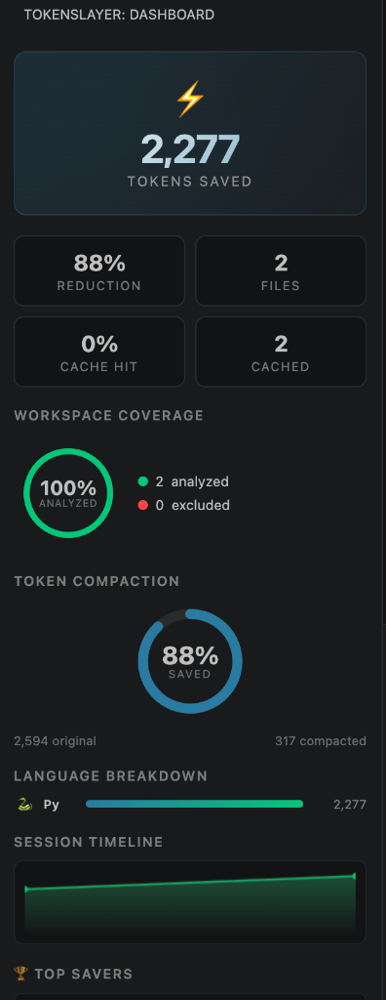
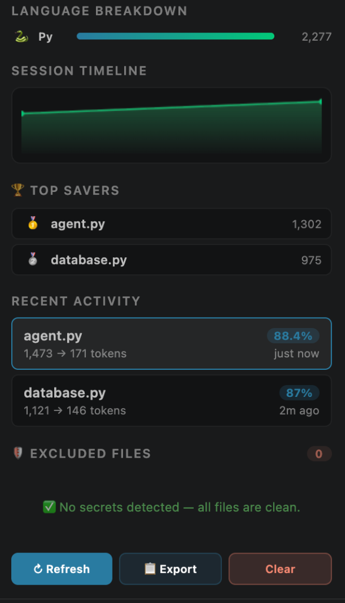
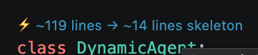

<div align="center">
  
  <h1>⚡ TokenSlayer</h1>
  <p><strong>Semantic Structural Cache for VS Code</strong><br/>Slash LLM token usage by 40–95% with AST-driven code skeletons</p>

  [](https://github.com/ajvikram/TokenSlayer/actions/workflows/ci.yml)
  [](https://github.com/ajvikram/TokenSlayer/actions/workflows/release.yml)
  [](https://code.visualstudio.com/)
  [](LICENSE)
  [](https://www.typescriptlang.org/)
</div>

---

## The Problem

AI coding assistants waste **up to 80% of tokens** during the "orientation phase" — reading massive files just to understand where a single function is. Every time Copilot needs context, it reads raw files, consuming thousands of tokens for information that could fit in a few lines.

```
Without TokenSlayer:  1,200 lines of raw code  →  5,000 tokens consumed
With TokenSlayer:     8-line structural skeleton →    200 tokens consumed (96% reduction)
```

**TokenSlayer** fixes this by registering as a Language Model Tool that gives Copilot compact AST-driven structural skeletons instead of raw file contents.

---

## ✨ Features

### 🧠 Three-Layer Semantic Engine

| Layer | What It Does | Performance |
|---|---|---|
| **AST Extraction** | Single LSP API call → full symbol tree | ~10ms per file |
| **Domain Compaction** | Language-specific compactors strip bodies, keep signatures | ~5ms (pure string ops) |
| **Semantic Caching** | Content-hash LRU cache with file-watcher invalidation | Instant on repeat |

### 🔧 Copilot Integration

Registered as `#tokenslayer-structural-summary` — a [Language Model Tool](https://code.visualstudio.com/api/extension-guides/language-model-tool) that Copilot can call autonomously:

```
@user: #tokenslayer-structural-summary How is authentication structured?

TokenSlayer → returns compact skeleton → Copilot answers using 200 tokens instead of 5,000
```

### 📊 Premium Sidebar Dashboard

<div align="center">
  <table>
    <tr>
      <td></td>
      <td></td>
    </tr>
    <tr>
      <td align="center"><em>Stats · Coverage Ring · Donut · Language Chart</em></td>
      <td align="center"><em>Timeline · Top Savers · Activity · Excluded Files</em></td>
    </tr>
  </table>
</div>

A real-time analytics dashboard with:

- **⚡ Hero Counter** — Animated token savings counter with gradient text
- **📈 Stats Grid** — Reduction %, files analyzed, cache hit rate, cached entries
- **🔵 Workspace Coverage Ring** — SVG circular progress showing analyzed vs total files
- **🍩 Donut Chart** — Animated circular chart showing compaction ratio
- **📊 Language Breakdown** — Horizontal bar chart with language icons (🔷 TS, 🐍 Python, 🔵 Go, ☕ Java, 🦀 Rust)
- **📈 Session Timeline** — Canvas sparkline showing analysis activity over time
- **🏆 Top Savers Leaderboard** — Top 5 files by token savings with 🥇🥈🥉 medals
- **📋 Recent Activity** — Clickable file cards with reduction badges
- **🛡️ Excluded Files** — Files blocked for containing secrets, with severity badges
- **🔄 Auto-Refresh** — Dashboard updates every 5 seconds automatically

### ⚡ Inline CodeLens

TokenSlayer adds reducibility indicators directly in your editor:

```
⚡ 69.7% reducible — 373 → 113 tokens        ← File-level indicator
class MemoryManager:
  ⚡ ~30 lines → ~9 lines skeleton             ← Class-level indicator
  def __init__(self, agent_id):
```

<div align="center">
  
  <p><em>Real CodeLens indicator showing <code>⚡ ~119 lines → ~14 lines skeleton</code> above a class</em></p>
</div>

### 📂 File Explorer Badges

Color-coded badges appear on files in the Explorer sidebar:

| Badge | Meaning |
|---|---|
| ⚡ (green) | File analyzed & cached — shows reduction % on hover |
| 🔒 (red) | File excluded — contains detected secrets |

### 🛡️ Secrets Detection & Protection

Automatically scans files for credentials and blocks them from LLM context:

| Detection | Examples |
|---|---|
| **API Keys** | AWS (`AKIA...`), Google (`AIza...`), Stripe (`sk_live_...`) |
| **Tokens** | GitHub (`ghp_...`), GitLab (`glpat-...`), Slack (`xox...`) |
| **Private Keys** | RSA, PGP, SSH private keys, PEM/P12 certificates |
| **Database** | Connection strings (MongoDB, Postgres, MySQL, Redis) |
| **Passwords** | Hardcoded passwords, JWT secrets, SSH credentials |
| **Sensitive Files** | `.env`, `.pem`, `.key`, `credentials.json`, `.htpasswd` |

Excluded files appear in the dashboard with severity levels: 🔴 HIGH · 🟡 MEDIUM · 🟢 LOW

### 📋 Export Report

Generate a formatted Markdown report with complete savings analytics:

```markdown
# ⚡ TokenSlayer Report

## Summary
| Metric         | Value   |
|----------------|---------|
| Tokens Saved   | 191,283 |
| Reduction      | 95%     |
| Files Analyzed | 50      |

## Language Breakdown
| Language   | Files | Tokens Saved | Reduction |
|------------|-------|-------------|-----------|
| typescript | 12    | 144,060     | 96%       |
| python     | 38    | 47,223      | 67%       |
```

### 👁️ Skeleton Preview

Side-by-side comparison of original file vs structural skeleton with `TokenSlayer: Preview Skeleton` command.

### 🔌 Universal Local Server API

TokenSlayer exposes a local HTTP API (port `4733`) so external agents (like Claude Desktop, Cursor, or CLI tools) can query the structural cache independently of Copilot.
- `GET /analyze?path=/path/to/file` -> Returns JSON structural skeleton
- `GET /stats` -> Returns JSON token savings data

### 🤖 Cursor & Claude Desktop Support (MCP)

TokenSlayer includes a **True Standalone Node MCP Server**. It uses the zero-dependency parser to analyze your codebase instantly, **without requiring VS Code to be open!**

**How to use in Cursor:**
1. Open Cursor -> Settings -> Features -> MCP Servers
2. Click **+ Add New MCP Server**
3. Type: `command`
4. Command: `node /absolute/path/to/TokenSlayer/mcp-server/build/index.js`
5. Save! Cursor will instantly see the `analyze_files` and `analyze_workspace` tools.

### 🐍 The Universal Standalone Skill (Zero VS Code Dependency)

If you use Windsurf, Cursor, Antigravity, or the CLI, and **you do not want to use VS Code at all**, TokenSlayer provides a 100% standalone, zero-dependency parser: `standalone/tokenslayer.js`.

This script uses a custom brace-counting and indentation engine to mimic VS Code's AST extraction, allowing any agent to compact code natively.

**How to use as an Agent Skill (Windsurf / Antigravity):**
Just tell your agent:
> *"Use `node /path/to/TokenSlayer/standalone/tokenslayer.js <filepath>` to read files instead of reading them directly."*

**How to use via CLI:**
```bash
node standalone/tokenslayer.js src/extension.ts
```
*(Outputs the token-saving skeleton directly to your terminal!)*

---

## 🌐 Supported Languages

| Language | Compactor Features |
|---|---|
| **TypeScript / JavaScript** | Strips bodies, keeps signatures, interfaces, types, compacted imports |
| **Python** | Keeps signatures with type hints, decorators, first-line docstrings |
| **Go** | Keeps type/func signatures, struct fields, interface methods |
| **Java** | Keeps class/interface/enum, method signatures, Spring/Lombok/JPA/JUnit annotations |
| **Rust** | Keeps struct/enum/trait/impl, function signatures, derive macros, cfg/test attributes |
| **C#** | Keeps record/struct/class, signatures, properties, ASP.NET attributes `[Route]`, `[ApiController]` |
| **Kotlin** | Keeps data class/object, val/var, JVM/Spring annotations `@RestController`, `@JvmStatic` |

---

## 🚀 Getting Started

### Requirements

- **VS Code** 1.93+
- **GitHub Copilot Chat** extension (for LM Tool integration)

### Install from VSIX

1. Download the latest `.vsix` from [Releases](https://github.com/ajvikram/TokenSlayer/releases)
2. In VS Code: `Cmd+Shift+P` → `Extensions: Install from VSIX...`
3. Select the downloaded file
4. Reload VS Code

### First Use

1. Open any project with supported source files
2. The ⚡ **TokenSlayer** sidebar appears in the Activity Bar
3. Files are **auto-analyzed** when you open or save them
4. Use `Cmd+Shift+P` → `TokenSlayer: Analyze Workspace` to scan all files at once
5. In Copilot Chat, type `#tokenslayer-structural-summary` to explicitly use the tool

---

## ⌨️ Commands

| Command | Description |
|---|---|
| `TokenSlayer: Analyze Workspace` | Scan all supported files in the workspace |
| `TokenSlayer: Analyze Current File` | Analyze the active editor file |
| `TokenSlayer: Preview Skeleton` | Open skeleton preview alongside the file |
| `TokenSlayer: Show Dashboard` | Focus the sidebar dashboard |
| `TokenSlayer: Export Savings Report` | Generate a Markdown savings report |
| `TokenSlayer: Clear Cache` | Purge all cached skeletons |

---

## ⚙️ Settings

| Setting | Default | Description |
|---|---|---|
| `tokenslayer.maxFileSizeKB` | `500` | Max file size to analyze (KB) |
| `tokenslayer.cacheMaxEntries` | `500` | Max cached skeletons before LRU eviction |
| `tokenslayer.verbosity` | `standard` | Skeleton detail level: `minimal` / `standard` / `detailed` |
| `tokenslayer.ignoredPaths` | `node_modules, dist, ...` | Glob patterns to exclude from analysis |

---

## 🏗️ Architecture

```
┌─────────────────────────────────────────────────────────┐
│                   VS Code Extension Host                │
├─────────────────────────────────────────────────────────┤
│                                                         │
│  ┌──────────────┐    ┌──────────────┐    ┌───────────┐  │
│  │  LM Tool     │    │  Dashboard   │    │ CodeLens  │  │
│  │  (Copilot)   │    │  (Webview)   │    │ Provider  │  │
│  └──────┬───────┘    └──────┬───────┘    └─────┬─────┘  │
│         │                   │                  │        │
│  ┌──────▼───────────────────▼──────────────────▼─────┐  │
│  │              Structural Summary Tool               │  │
│  ├────────────────────────────────────────────────────┤  │
│  │  ┌──────────┐  ┌──────────────┐  ┌─────────────┐  │  │
│  │  │ Secrets  │  │   Symbol     │  │  Skeleton   │  │  │
│  │  │ Detector │  │  Extractor   │  │  Builder    │  │  │
│  │  │          │  │  (1 LSP call)│  │             │  │  │
│  │  └────┬─────┘  └──────┬───────┘  └──────┬──────┘  │  │
│  │       │               │                 │         │  │
│  │  ┌────▼───────────────▼─────────────────▼──────┐  │  │
│  │  │          Domain Compactors                   │  │  │
│  │  │  TS/JS │ Python │ Go │ Java │ Rust           │  │  │
│  │  └────────────────────┬─────────────────────────┘  │  │
│  │                       │                            │  │
│  │  ┌────────────────────▼─────────────────────────┐  │  │
│  │  │           LRU Cache Manager                  │  │  │
│  │  │    Content-hash keys │ File watcher           │  │  │
│  │  │    Disk persistence  │ Auto-invalidation      │  │  │
│  │  └──────────────────────────────────────────────┘  │  │
│  └────────────────────────────────────────────────────┘  │
│                                                         │
│  ┌──────────────┐    ┌──────────────┐    ┌───────────┐  │
│  │  File Decor  │    │  Skeleton    │    │  Status   │  │
│  │  Provider    │    │  Preview     │    │  Bar      │  │
│  └──────────────┘    └──────────────┘    └───────────┘  │
└─────────────────────────────────────────────────────────┘
```

---

## 🛠️ Development

```bash
# Clone the repository
git clone https://github.com/ajvikram/TokenSlayer.git
cd TokenSlayer

# Install dependencies
npm install

# Compile
npm run compile

# Watch mode (auto-recompile on changes)
npm run watch

# Package as VSIX
npx @vscode/vsce package --no-dependencies --allow-missing-repository
```

Press **F5** to launch the Extension Development Host for testing.

### Project Structure

```
TokenSlayer/
├── src/
│   ├── extension.ts              # Entry point — registers everything
│   ├── types.ts                  # Shared TypeScript interfaces
│   ├── extraction/
│   │   ├── symbolExtractor.ts    # LSP symbol tree extraction (1 API call)
│   │   └── skeletonBuilder.ts    # Symbol tree → compact text
│   ├── compaction/
│   │   ├── compactor.ts          # Interface + factory router
│   │   ├── typescriptCompactor.ts
│   │   ├── pythonCompactor.ts
│   │   ├── goCompactor.ts
│   │   ├── javaCompactor.ts
│   │   └── rustCompactor.ts
│   ├── cache/
│   │   └── cacheManager.ts       # LRU cache with persistence
│   ├── tools/
│   │   └── structuralSummaryTool.ts  # LM Tool for Copilot
│   ├── views/
│   │   ├── dashboardProvider.ts  # Sidebar webview dashboard
│   │   ├── skeletonPreviewProvider.ts
│   │   ├── codeLensProvider.ts   # Inline ⚡ indicators
│   │   └── fileDecorationProvider.ts # Explorer badges
│   └── utils/
│       ├── logger.ts
│       ├── tokenEstimator.ts
│       └── secretsDetector.ts    # Credentials scanner
├── media/
│   ├── icon.png
│   └── dashboard.css
├── .github/workflows/
│   ├── ci.yml                    # CI: code check, build, security, package
│   └── release.yml               # Release: tag → VSIX → GitHub Release
└── package.json
```

---

## 📊 CI/CD Pipeline

| Job | Description | Status |
|---|---|---|
| 🔍 **Code Quality** | TypeScript type checking, linting | [](https://github.com/ajvikram/TokenSlayer/actions/workflows/ci.yml) |
| 🔨 **Build** | Multi-node compilation (Node 18, 20, 22) | [](https://github.com/ajvikram/TokenSlayer/actions/workflows/ci.yml) |
| 🛡️ **Security** | npm audit, secrets scan, license compliance | [](https://github.com/ajvikram/TokenSlayer/actions/workflows/ci.yml) |
| 📦 **Package** | VSIX artifact upload | [](https://github.com/ajvikram/TokenSlayer/actions/workflows/ci.yml) |
| 🚀 **Release** | Tag-triggered VSIX release | [](https://github.com/ajvikram/TokenSlayer/actions/workflows/release.yml) |

### Creating a Release

```bash
# Tag a release
git tag v0.1.0
git push origin v0.1.0

# GitHub Actions will automatically:
# 1. Run all CI checks
# 2. Package the VSIX
# 3. Create a GitHub Release with the VSIX attached
```

---

## 🤔 How It Compares

| Approach | API Calls/File | Token Cost | Latency |
|---|---|---|---|
| Raw file reading | 0 | 5,000+ tokens | Instant (but wasteful) |
| TokenSlayer | 1 (LSP) | 200–500 tokens | ~15ms (first), 0ms (cached) |
| Full AST parser (tree-sitter) | N/A | Low | High (heavy dependency) |

**Why 1 API call?** We deliberately cut Call Graph Extractor, Type Hierarchy Extractor, and Query Matcher to keep performance at a single `executeDocumentSymbolProvider` call per file instead of 60+.

---

## 📝 License

[MIT](LICENSE) — Built with ⚡ by [Ajay Vikram](https://github.com/ajvikram)
