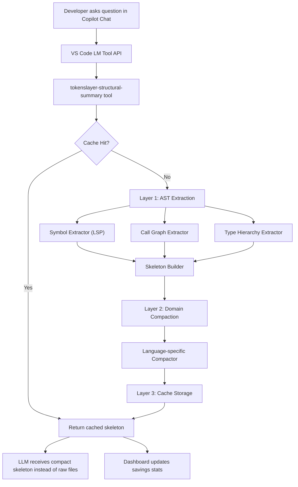

# TokenSlayer — Semantic Structural Cache for VS Code

Build a VS Code extension that intercepts LLM context, extracts AST-driven structural skeletons, applies domain-aware compaction, and caches results locally — reducing token usage by **40-95%**.

---

## User Review Required

> [!IMPORTANT]
> **Language Model Tool API requires VS Code 1.93+** and the `github.copilot-chat` extension. The tool will be registered as `#tokenslayer-structural-summary` so Copilot can call it to orient itself in large codebases.

> [!WARNING]
> **Tree-sitter native bindings** require a native build step. We'll use `web-tree-sitter` (WASM-based) instead to avoid native compilation issues and ensure cross-platform compatibility. This means slightly slower initial parse times (~50ms) but full portability.

> [!IMPORTANT]
> **Scope of V1**: The first release will support **TypeScript/JavaScript**, **Python**, **Go**, **SQL**, and **React/JSX** compaction templates. Additional languages can be added later via pluggable compactors.

---

## Proposed Changes

### Project Scaffolding & Configuration

#### [NEW] [package.json](file:///Users/ajaysingh/Ajay/work/TokenSlayer/package.json)
VS Code extension manifest defining:
- **Extension metadata**: name `tokenslayer`, display name "TokenSlayer", publisher, icon
- **Activation events**: `onStartupFinished` (lazy activation after VS Code loads)
- **Commands**: 
  - `tokenslayer.analyzeWorkspace` — Full workspace structural scan
  - `tokenslayer.analyzeFile` — Analyze current file
  - `tokenslayer.showDashboard` — Open the savings dashboard
  - `tokenslayer.clearCache` — Purge the semantic cache
  - `tokenslayer.showSkeleton` — Preview the structural skeleton for the active file
- **Language Model Tools** (`contributes.languageModelTools`):
  - `tokenslayer-structural-summary`: Tool that Copilot can call to get compressed structural context
    - `modelDescription`: Detailed description so the LLM knows when to call it
    - `inputSchema`: JSON Schema accepting `{ filePath?, query?, scope? }`
- **Views / View Containers**: Sidebar "TokenSlayer" view container with a webview-based dashboard
- **Configuration**: User settings for cache TTL, max file size, ignored paths, compaction aggressiveness

#### [NEW] [tsconfig.json](file:///Users/ajaysingh/Ajay/work/TokenSlayer/tsconfig.json)
TypeScript configuration targeting ES2022, strict mode, outDir `./out`.

#### [NEW] [.vscodeignore](file:///Users/ajaysingh/Ajay/work/TokenSlayer/.vscodeignore)
Exclude source files, node_modules, etc. from VSIX packaging.

#### [NEW] [.vscode/launch.json](file:///Users/ajaysingh/Ajay/work/TokenSlayer/.vscode/launch.json)
Debug configurations for Extension Development Host.

#### [NEW] [.vscode/tasks.json](file:///Users/ajaysingh/Ajay/work/TokenSlayer/.vscode/tasks.json)
Build tasks (npm compile, npm watch).

---

### Layer 1: AST-Awareness Engine

#### [NEW] [src/extraction/symbolExtractor.ts](file:///Users/ajaysingh/Ajay/work/TokenSlayer/src/extraction/symbolExtractor.ts)
Leverages VS Code's built-in LSP to extract document symbols:
- Uses `vscode.commands.executeCommand('vscode.executeDocumentSymbolProvider', uri)` to get symbol trees
- Recursively walks `DocumentSymbol[]` to build a flat list of `StructuralSymbol` objects
- Extracts: name, kind (class/function/interface/enum/etc.), range, children count, signature line

#### [NEW] [src/extraction/skeletonBuilder.ts](file:///Users/ajaysingh/Ajay/work/TokenSlayer/src/extraction/skeletonBuilder.ts)
Combines symbol data into a **compact structural skeleton** (no call graph / type hierarchy traversal — those were cut for performance):
- Generates a compact text representation from symbols alone:
  ```
  // File: src/auth/service.ts (1,200 lines → 8-line skeleton)
  class AuthService extends BaseService
    ├─ login(credentials: Credentials): Promise<Token>
    ├─ logout(token: Token): void
    └─ refreshToken(token: Token): Promise<Token>
  interface Credentials { username: string; password: string }
  type Token = { jwt: string; expiresAt: Date }
  ```
- Configurable verbosity levels: `minimal` | `standard` | `detailed`

---

### Layer 2: Domain Compaction Engine

#### [NEW] [src/compaction/compactor.ts](file:///Users/ajaysingh/Ajay/work/TokenSlayer/src/compaction/compactor.ts)
Base compactor interface & factory:
```typescript
interface ICompactor {
  languageId: string;
  compact(symbols: StructuralSymbol[], fileContent: string): CompactedResult;
}
```
- Factory maps `languageId` → specific compactor implementation
- Returns `CompactedResult`: `{ skeleton: string, tokenEstimate: number, reductionPercent: number }`

#### [NEW] [src/compaction/typescriptCompactor.ts](file:///Users/ajaysingh/Ajay/work/TokenSlayer/src/compaction/typescriptCompactor.ts)
TypeScript/JavaScript-specific compaction:
- Strips function bodies, keeps only signatures
- Preserves interface/type definitions fully
- Keeps `import` statements but compacts barrel exports
- Identifies React components → keeps props interface, strips JSX body
- Strips comments, decorators (optionally preserved via setting)

#### [NEW] [src/compaction/pythonCompactor.ts](file:///Users/ajaysingh/Ajay/work/TokenSlayer/src/compaction/pythonCompactor.ts)
Python-specific compaction:
- Keeps `class` and `def` signatures with type hints
- Preserves `@dataclass` and `@property` decorators
- Strips function bodies, keeps docstrings (first line only)
- Compacts `import` sections

#### [NEW] [src/compaction/goCompactor.ts](file:///Users/ajaysingh/Ajay/work/TokenSlayer/src/compaction/goCompactor.ts)
Go-specific compaction:
- Keeps `type` and `func` signatures
- Preserves interface definitions and struct fields
- Strips function bodies

> [!NOTE]
> SQL compactor deferred to V2 — SQL files lack good LSP symbol support, requiring custom regex parsing.

---

### Layer 3: Semantic Caching Engine

#### [NEW] [src/cache/cacheManager.ts](file:///Users/ajaysingh/Ajay/work/TokenSlayer/src/cache/cacheManager.ts)
Local persistence layer for structural summaries:
- Uses VS Code's `globalStorageUri` / `storageUri` for persistence
- Cache key: `hash(filePath + fileContentHash)` — invalidated on file change
- File watcher (`vscode.workspace.onDidChangeTextDocument`) triggers re-extraction
- Configurable TTL (default: until file changes)
- LRU eviction policy with configurable max size (default: 500 entries)
- In-memory LRU map backed by JSON file on disk

> [!NOTE]
> Query matcher was cut — cache is keyed by file content hash, which covers the common case without the complexity/false-positive risk of keyword matching.

---

### Tool Integration (VS Code Language Model Tool API)

#### [NEW] [src/tools/structuralSummaryTool.ts](file:///Users/ajaysingh/Ajay/work/TokenSlayer/src/tools/structuralSummaryTool.ts)
Implements `vscode.LanguageModelTool<StructuralSummaryInput>`:
- **`prepareInvocation()`**: Returns confirmation message showing which files will be analyzed and estimated token savings
- **`invoke()`**: Core logic:
  1. Check cache for matching query/file
  2. If cache miss: run symbol extraction → compaction → skeleton generation
  3. Store in cache
  4. Return `LanguageModelToolResult` with the compact skeleton
  5. Track token savings metrics
- Registered via `vscode.lm.registerTool('tokenslayer-structural-summary', ...)`

---

### Sidebar Dashboard (Webview)

#### [NEW] [src/views/dashboardProvider.ts](file:///Users/ajaysingh/Ajay/work/TokenSlayer/src/views/dashboardProvider.ts)
`WebviewViewProvider` for the sidebar dashboard:
- Registers in the `tokenslayer-sidebar` view container
- Communicates with extension via `postMessage` / `onDidReceiveMessage`
- Sends real-time stats: tokens saved, cache hit rate, files analyzed

#### [NEW] [src/views/dashboard.html](file:///Users/ajaysingh/Ajay/work/TokenSlayer/src/views/dashboard.html)
Stunning sidebar UI with:
- **Hero stat**: Total tokens saved (animated counter)
- **Savings chart**: Bar chart showing per-file token reduction (CSS-only, no external charting lib)
- **Cache status**: Hit rate %, entries count, storage size
- **Recent activity**: List of recently compacted files with savings %
- **Theme-aware**: Uses VS Code CSS variables (`--vscode-*`) for perfect theme integration
- Dark glassmorphism aesthetic with subtle gradients and micro-animations

#### [NEW] [src/views/skeletonPreviewProvider.ts](file:///Users/ajaysingh/Ajay/work/TokenSlayer/src/views/skeletonPreviewProvider.ts)
Virtual document provider (read-only) for previewing the structural skeleton:
- Opens as a lightweight editor tab (no heavy WebviewPanel)
- Shows the skeleton output with the file's original language for syntax highlighting
- Header comment shows original vs skeleton line/token counts

---

### Extension Entry Point

#### [NEW] [src/extension.ts](file:///Users/ajaysingh/Ajay/work/TokenSlayer/src/extension.ts)
Main activation point:
1. Initialize cache manager (load from disk)
2. Register the `tokenslayer-structural-summary` LM tool
3. Register all commands
4. Register the sidebar webview provider
5. Set up file watchers for cache invalidation
6. Register status bar item showing "⚡ X tokens saved"
7. Log activation to output channel

#### [NEW] [src/utils/tokenEstimator.ts](file:///Users/ajaysingh/Ajay/work/TokenSlayer/src/utils/tokenEstimator.ts)
Lightweight token count estimator:
- Uses the ~4 chars per token heuristic for English/code
- Counts original file tokens vs skeleton tokens
- Tracks cumulative savings across session

#### [NEW] [src/utils/logger.ts](file:///Users/ajaysingh/Ajay/work/TokenSlayer/src/utils/logger.ts)
OutputChannel-based logger with levels (debug, info, warn, error).

#### [NEW] [src/types.ts](file:///Users/ajaysingh/Ajay/work/TokenSlayer/src/types.ts)
Shared TypeScript interfaces:
- `StructuralSymbol`, `CallGraphNode`, `TypeHierarchyNode`
- `CompactedResult`, `CacheEntry`, `TokenSavings`
- `StructuralSummaryInput` (tool input schema)

---

### Assets

#### [NEW] [media/icon.png](file:///Users/ajaysingh/Ajay/work/TokenSlayer/media/icon.png)
Extension icon — lightning bolt / token-slashing motif.

#### [NEW] [media/dashboard.css](file:///Users/ajaysingh/Ajay/work/TokenSlayer/media/dashboard.css)
Styles for the sidebar webview dashboard.

---

## Architecture Diagram



---

## Open Questions

> [!IMPORTANT]
> **Query matching sophistication**: The design mentions serving cached skeletons for "similar questions" (e.g., "How do I add a new route?"). V1 uses simple keyword matching. Should we invest in embedding-based similarity for V2, or is keyword matching sufficient for launch?

> [!NOTE]
> **Compaction aggressiveness**: Should we default to `standard` verbosity (keeps signatures + first-line docstrings) or `minimal` (signatures only)? This affects token savings vs context quality.

---

## Verification Plan

### Automated Tests

```bash
# Compile the extension
npm run compile

# Run extension tests in VS Code test runner
npm test

# Package the extension
npx @vscode/vsce package --no-dependencies
```

- **Unit tests** for each compactor (TypeScript, Python, SQL, Go) verifying correct skeleton output
- **Unit tests** for cache manager (hit/miss/eviction/invalidation)
- **Unit tests** for token estimator accuracy
- **Integration tests** using VS Code Extension Test API to verify:
  - Symbol extraction returns valid structures
  - LM tool registration and invocation works
  - Dashboard webview loads and displays stats

### Manual Verification
1. **Install extension in Extension Development Host** (F5)
2. Open a large TypeScript project → run "Analyze Workspace"
3. Verify sidebar dashboard shows token savings
4. Use Copilot Chat and reference `#tokenslayer-structural-summary` → verify compact skeletons are returned
5. Modify a file → verify cache invalidation and re-extraction
6. Run "Show Skeleton" command → verify preview panel with side-by-side comparison
